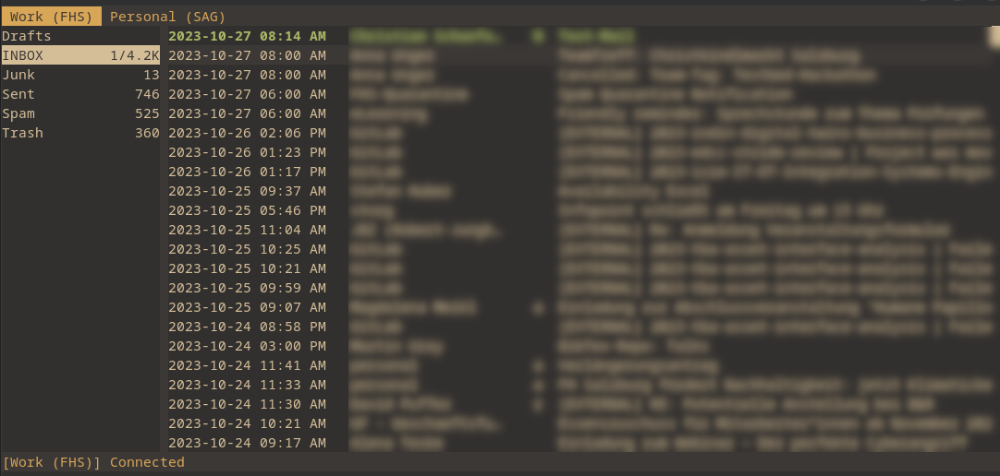

# aerc gruvbox-material theme

Inspired by https://github.com/sainnhe/gruvbox-material, this repository
contains the gruvbox material theme for the mail client `aerc`. The following
screenshot shows an example for the styleset `gruvbox_material_dark_soft`.

<center>
    </img>
</center>

## Usage

Copy the directory `stylesets` in the aerc configuration dir(`~/.config/aerc/`).
Then, adapt the `styleset-name` value in the `aerc` configuration: 
(`~/.config/aerc/aerc.conf`) to your desired scheme. E.g.:

```ini
# Sets the styleset to use for the aerc ui elements.
#
# Default: default
styleset-name=gruvbox_material_dark_soft
```

## Contribution

Feel free to open PRs and contribute your ideas. Open ToDos include the support
for light mode and improvements for existing coloring schemes. 
